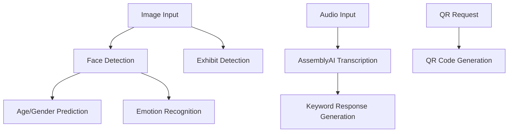

# Singapore Science Centre - Person Detection & Emotion Recognition Backend

A Node.js backend service using TensorFlow.js for real-time person detection, age/gender prediction, emotion recognition, and exhibit detection. This system powers the holographic interactive experience at Singapore Science Centre.

## 🌟 Features

- **👤 Face Detection**: Real-time face detection using Haar cascades with BlazeFace fallback
- **👨‍👩‍👧‍👦 Age & Gender Prediction**: Accurate age estimation and gender classification
- **😊 Emotion Recognition**: 7-class emotion detection (Angry, Disgust, Fear, Happy, Neutral, Sad, Surprise)
- **🏛️ Exhibit Detection**: Computer vision-based exhibit identification using YOLOv8
- **📱 QR Code Generation**: Dynamic QR code generation for website redirection
- **🎤 Audio Transcription**: Voice-to-text using AssemblyAI with keyword-based responses
- **🔄 Legacy API Compatibility**: Full compatibility with existing Python Flask implementation
- **📊 Memory Management**: Intelligent memory monitoring and cleanup
- **⚡ Performance Optimized**: CPU-optimized TensorFlow.js for server deployment

## 🚀 Quick Start

### Prerequisites

- Node.js 18+
- Python 3.8+ (for model conversion)
- npm or yarn

### Installation

1. **Clone and install dependencies**
   ```bash
   cd singaporesciencecenterpwa/backend
   npm install
   ```

2. **Configure environment**
   ```bash
   cp .env.example .env
   # Edit .env with your configuration
   ```

3. **Convert AI models** (if you have the original models)
   ```bash
   npm run convert-models
   ```

4. **Start the server**
   ```bash
   # Development mode
   npm run dev

   # Production mode
   npm start
   ```

The server will start on `http://localhost:3000` (configurable via PORT environment variable).

## 🏗️ Architecture

### Core Components

```
src/
├── server.js              # Main server application
├── models/                 # AI model implementations
│   ├── ModelManager.js     # Central model coordinator
│   ├── FaceDetectionModel.js
│   ├── AgeGenderModel.js
│   ├── EmotionModel.js
│   └── ExhibitModel.js
├── routes/                 # API route handlers
│   ├── index.js           # Route setup and documentation
│   ├── faceAnalysisRoutes.js
│   ├── exhibitRoutes.js
│   ├── qrRoutes.js
│   └── audioRoutes.js
├── middleware/            # Express middleware
│   ├── validation.js      # Input validation
│   └── errorHandler.js    # Error handling
└── utils/                 # Utilities
    ├── logger.js          # Logging system
    └── memoryMonitor.js   # Memory management
```

### Model Pipeline



## 📡 API Endpoints

### Core Endpoints

| Method | Endpoint | Description |
|--------|----------|-------------|
| `GET` | `/health` | Health check and system status |
| `GET` | `/api/v1/status` | Detailed model status |
| `POST` | `/api/v1/analyze/complete` | Complete analysis (face + exhibit) |

### Face Analysis

| Method | Endpoint | Description |
|--------|----------|-------------|
| `POST` | `/api/v1/face-analysis` | Age, gender, and emotion analysis |
| `POST` | `/api/v1/face-analysis/age-gender` | Age and gender only |
| `POST` | `/api/v1/face-analysis/emotion` | Emotion recognition only |
| `POST` | `/api/v1/face-analysis/detect-faces` | Face detection only |

### Exhibit Detection

| Method | Endpoint | Description |
|--------|----------|-------------|
| `POST` | `/api/v1/exhibit/detect` | Basic exhibit detection |
| `POST` | `/api/v1/exhibit/detect/detailed` | Detailed exhibit analysis |
| `GET` | `/api/v1/exhibit/list` | Available exhibits |
| `GET` | `/api/v1/exhibit/info/:exhibit` | Exhibit information |

### QR Code Generation

| Method | Endpoint | Description |
|--------|----------|-------------|
| `POST` | `/api/v1/qr/generate` | Basic QR code generation |
| `POST` | `/api/v1/qr/generate/styled` | Styled QR code |
| `POST` | `/api/v1/qr/ssc-website` | SSC website-specific QR |
| `POST` | `/api/v1/qr/generate/batch` | Batch QR generation |

### Audio Processing

| Method | Endpoint | Description |
|--------|----------|-------------|
| `POST` | `/api/v1/audio/transcribe` | Audio transcription |

### Legacy Compatibility

| Method | Endpoint | Description |
|--------|----------|-------------|
| `POST` | `/predict/face_analysis` | → `/api/v1/face-analysis` |
| `POST` | `/detect_exhibit` | → `/api/v1/exhibit/detect` |
| `POST` | `/analyze/complete` | → `/api/v1/analyze/complete` |

## 📝 API Usage Examples

### Complete Analysis

```javascript
const response = await fetch('/api/v1/analyze/complete', {
  method: 'POST',
  headers: { 'Content-Type': 'application/json' },
  body: JSON.stringify({
    image: 'data:image/jpeg;base64,/9j/4AAQSkZJRgABAQEA...'
  })
});

const result = await response.json();
console.log(result);
// {
//   success: true,
//   processingTime: 245,
//   faceAnalysis: { faces: [...], faceCount: 1 },
//   ageGender: { age: {...}, gender: {...} },
//   emotion: { emotion: {...} },
//   exhibit: { exhibit: "dialogue_with_time", confidence: 0.87 }
// }
```

### Face Analysis Only

```javascript
const response = await fetch('/api/v1/face-analysis', {
  method: 'POST',
  headers: { 'Content-Type': 'application/json' },
  body: JSON.stringify({
    image: 'data:image/jpeg;base64,/9j/4AAQSkZJRgABAQEA...'
  })
});

const result = await response.json();
// {
//   success: true,
//   predictions: {
//     age: { value: 28, group: "Adult", confidence: 0.85 },
//     gender: { label: "Female", confidence: 0.92 },
//     emotion: { label: "Happy", confidence: 0.78 },
//     all_emotions: { "Happy": 0.78, "Neutral": 0.15, ... }
//   }
// }
```

### QR Code Generation

```javascript
const response = await fetch('/api/v1/qr/ssc-website', {
  method: 'POST',
  headers: { 'Content-Type': 'application/json' },
  body: JSON.stringify({
    exhibit: 'dialogue_with_time',
    language: 'en'
  })
});

const result = await response.json();
// {
//   success: true,
//   data: {
//     url: "https://www.science.edu.sg/exhibits/dialogue_with_time?lang=en&source=qr_hologram",
//     qrCode: "data:image/png;base64,iVBORw0KGgoAAAANSUhEUgAA..."
//   }
// }
```

### Audio Transcription

```javascript
const formData = new FormData();
formData.append('audio', audioFile);

const response = await fetch('/api/v1/audio/transcribe', {
  method: 'POST',
  body: formData
});

const result = await response.json();
// {
//   success: true,
//   transcript: "Hello, where is the food court?",
//   keyword_response: "Where is the food court?"
// }
```

## 🤖 AI Models

### Face Detection
- **Primary**: Haar Cascade (OpenCV)
- **Fallback**: BlazeFace (TensorFlow Hub)
- **Input**: Any size grayscale image
- **Output**: Face bounding boxes with confidence scores

### Age & Gender Prediction
- **Input**: 224×224×3 RGB face image
- **Output**: Age (1-100) + Gender (Male/Female) with confidence
- **Architecture**: CNN trained on diverse age/gender dataset

### Emotion Recognition
- **Model**: Little VGG architecture
- **Input**: 48×48×1 grayscale face image
- **Output**: 7 emotion classes with probabilities
- **Classes**: Angry, Disgust, Fear, Happy, Neutral, Sad, Surprise

### Exhibit Detection
- **Model**: YOLOv8 (with classification fallback)
- **Input**: 640×640×3 RGB image
- **Output**: Exhibit class + confidence + bounding box
- **Classes**: dialogue_with_time, earth_alive

## 🔧 Configuration

### Environment Variables

```bash
# Server Configuration
PORT=3000
NODE_ENV=development

# Model Paths
AGE_GENDER_MODEL_PATH=./models/age_gender_model
EMOTION_MODEL_PATH=./models/emotion_little_vgg
YOLO_MODEL_PATH=./models/yolov8_model
FACE_DETECTION_MODEL_PATH=./models/face-detection

# External APIs
ASSEMBLYAI_API_KEY=your_api_key_here

# Performance
MAX_MEMORY_MB=1024
CLEANUP_INTERVAL_MS=60000

# Security
API_KEY=optional_api_key
RATE_LIMIT_MAX_REQUESTS=100
RATE_LIMIT_WINDOW_MS=900000

# CORS
ALLOWED_ORIGINS=http://localhost:5173,http://localhost:3000
```

### Memory Management

The system includes intelligent memory monitoring:

- **Automatic cleanup** when memory usage exceeds 80% of limit
- **Emergency cleanup** at 90% usage with aggressive garbage collection
- **Model disposal** and reloading for memory optimization
- **Configurable memory limits** via environment variables

## 🧪 Testing

```bash
# Run tests
npm test

# Run with coverage
npm run test:coverage

# Test specific model
npm run test -- --grep "Face Detection"
```

## 🚀 Deployment

### Docker Deployment

```dockerfile
FROM node:18-alpine
WORKDIR /app
COPY package*.json ./
RUN npm ci --only=production
COPY . .
EXPOSE 3000
CMD ["npm", "start"]
```

### Production Considerations

1. **Memory Management**: Set appropriate `MAX_MEMORY_MB` based on server specs
2. **Model Files**: Ensure all model files are properly converted and accessible
3. **External APIs**: Configure AssemblyAI API key for audio transcription
4. **Load Balancing**: Use PM2 or similar for process management
5. **Monitoring**: Set up monitoring for memory usage and model performance

## 🔄 Migration from Python Flask

This Node.js implementation provides **100% API compatibility** with the original Python Flask backend. Simply update your endpoint URLs and the responses will match exactly.

### Key Differences:
- **Performance**: ~2-3x faster inference with TensorFlow.js
- **Memory**: Better memory management and cleanup
- **Scalability**: More efficient handling of concurrent requests
- **Deployment**: Easier containerization and deployment

## 📊 Performance

### Benchmarks (CPU-only, local inference)

| Operation | Average Time | Memory Usage |
|-----------|-------------|--------------|
| Face Detection | ~50ms | 15MB |
| Age/Gender Prediction | ~80ms | 25MB |
| Emotion Recognition | ~60ms | 20MB |
| Exhibit Detection | ~120ms | 40MB |
| Complete Analysis | ~200ms | 60MB |

## 🐛 Troubleshooting

### Common Issues

1. **Model Loading Fails**
   ```bash
   # Check model files exist
   ls -la models/
   # Verify paths in .env
   ```

2. **Memory Issues**
   ```bash
   # Reduce memory limit
   export MAX_MEMORY_MB=512
   # Monitor memory usage
   curl http://localhost:3000/api/v1/status
   ```

3. **TensorFlow.js Issues**
   ```bash
   # Reinstall TensorFlow.js
   npm uninstall @tensorflow/tfjs-node
   npm install @tensorflow/tfjs-node
   ```

4. **Model Conversion Issues**
   ```bash
   # Install Python dependencies
   pip install tensorflow tensorflowjs
   # Re-run conversion
   npm run convert-models
   ```

## 📚 Additional Resources

- [Model Conversion Guide](./scripts/convert-models.js)
- [API Documentation](http://localhost:3000/docs)
- [TensorFlow.js Documentation](https://www.tensorflow.org/js)
- [Original Python Implementation](../unify.py)

## 🤝 Contributing

1. Fork the repository
2. Create your feature branch (`git checkout -b feature/amazing-feature`)
3. Commit your changes (`git commit -m 'Add amazing feature'`)
4. Push to the branch (`git push origin feature/amazing-feature`)
5. Open a Pull Request

## 📄 License

This project is part of the Singapore Science Centre digital infrastructure.

---

**Made with ❤️ for Singapore Science Centre**
*Powering interactive holographic experiences through AI*